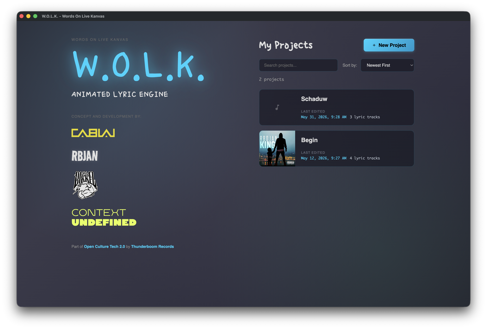
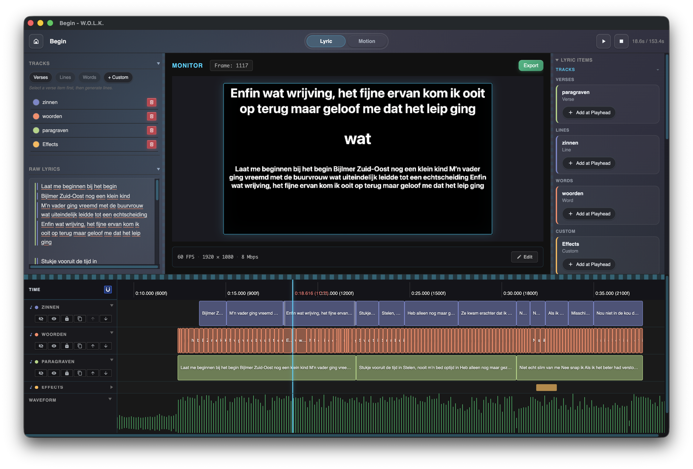
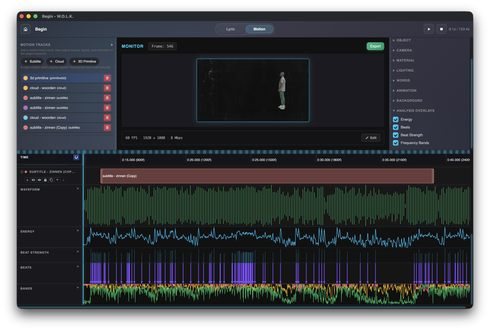
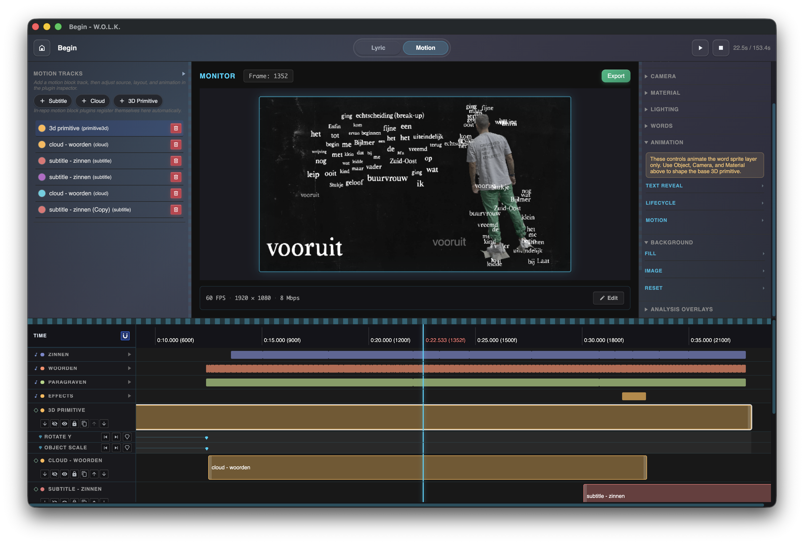
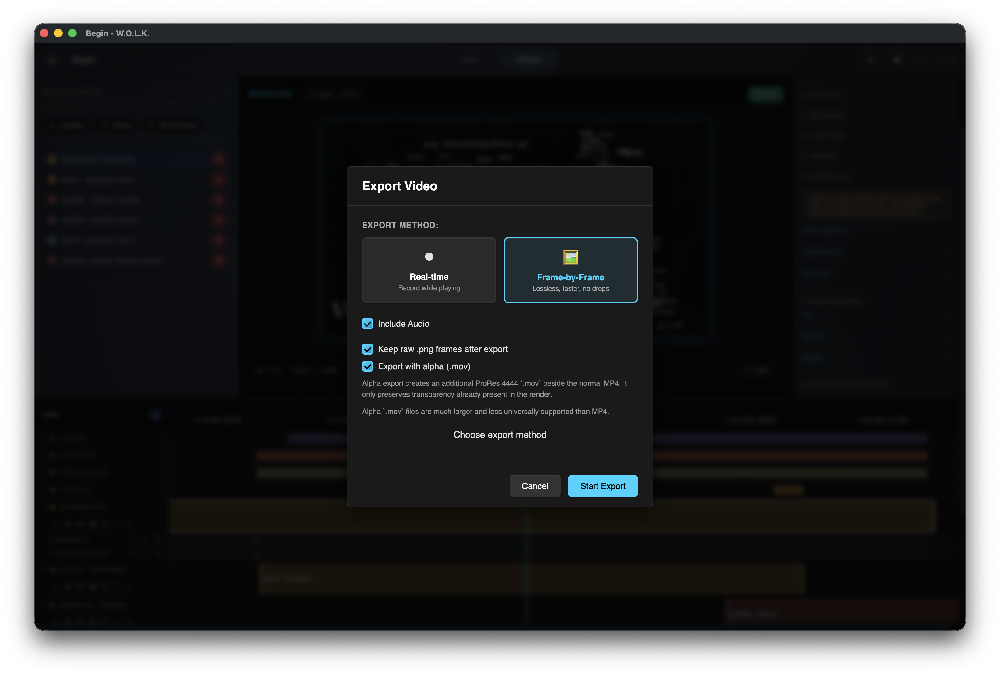

# W.O.L.K. — Words On Live Kanvas

**An open-source desktop tool that turns song lyrics into motion graphics.**

W.O.L.K. was built for [RBDJAN](https://rbdjan.nl/), a Dutch rapper (who is walking cultural herritage!) works with language as a deliberate artistic material. Together with creative studio [Cablai](https://www.cablai.com/), [VJ Bikkel](https://bikkelamsterdam.nl/blog/vj/), and [Context Undefined](https://contextundefined.nl) (Wesley Hartogs | Creative Technologist) — under the [Open Culture Tech 2.0](https://www.openculturetech.com/) initiative — W.O.L.K. became a full authoring environment for lyric-driven visuals.

Start with your lyrics. Time them. Design the motion. Export video. The tool is yours to jumping board. Create with language!


## Screenshots

**Project home** — browse and open lyric projects.



**Lyric mode** — paste raw lyrics, generate verse/line/word tracks, and time them on the timeline.



**Motion mode** — assign subtitle, cloud, and 3D blocks to lyric tracks with live preview and audio analysis overlays.



**Motion blocks in action** — word clouds, 3D primitives, and keyframed animation on the timeline.



**Export** — frame-by-frame or real-time, with optional alpha MOV pass.




## What Makes It Different

Most motion tools make you build animations from scratch. W.O.L.K. starts from your **words**.

Paste lyrics and the app understands the structure: verses, lines, individual words. Generate timed tracks from that structure, then assign motion blocks — subtitle layouts, word clouds, 3D geometry with text attached — to those tracks. Every clip on the timeline is draggable, splittable, and frame-accurate.

Animation is built in, not bolted on. Each item gets composable **enter and exit** transitions: fade, slide from any direction, and scale can run together in the same window, with easing from linear through bounce and overshoot. Turn on **typewriter** reveal and text types in character-by-character on entry and deletes on exit — optional cursor included. Split the timing so typing only uses part of the enter/exit window, leaving room for the slide or fade to keep moving after the last letter lands. Override enter/exit, typography, or position on individual words when one line needs a different punch. Keyframe position, rotation, opacity, and block-specific properties when the defaults are not enough.

Variation is **deterministic by design**. A project seed controls all generative decisions — cloud positions, size variation, layout randomness — so two exports of the same project always produce the same result. Consistent across renders, repeatable across shows.

The tool is a foundation, not a finisher. Pipe the exported video into Resolume, After Effects, or any VJ software you already use.


## Motion Blocks

W.O.L.K. has three built-in block types. Each block points at a lyric track and handles a different visual language:

**Subtitle** — timed text with full typographic control. Fade, slide, scale, typewriter. Constraint regions, multi-line wrapping, per-word style overrides, rich text. The backbone of any lyrics-first performance.

**Cloud** — all active words at once, scattered across the frame. Positions are seeded per-item so the layout is stable between renders but looks generative to the audience. Size auto-fits to fill the region.

**Primitive3D** — Three.js geometry (box, sphere, cylinder, torus, or your own OBJ) with word sprites attached to anchor points on the surface. Keyframeable rotation, camera, and lighting. Billboard words that always face camera. A completely different register when you want the visual to carry physical weight.

All three blocks support keyframed properties, enter/exit animations, per-item overrides, and saveable presets.


## Lyric Workflow

```
Paste lyrics
    ↓
Generate Verses  (split on blank lines)
    ↓
Generate Lines   (from selected verse track)
    ↓
Generate Words   (from selected line track)
    ↓
Add motion blocks → adjust timing → export
```

Every item on every track is a draggable, resizable clip. Split items, solo tracks, mute layers, nudge timing to the frame. The timeline preview shows what renders in real time.


## Export

- **WebM** — always available, no extra dependencies
- **MP4** — requires a separately installed `ffmpeg` (see below)
- **Alpha MOV** — optional transparent pass for compositing
- Export settings: FPS, resolution, bitrate, audio inclusion, raw PNG frame retention

Projects and presets travel as archives:

| Format | Contents |
|---|---|
| `.wolk` | Full project archive — audio, assets, project data |
| `.wolkdpreset` | Single motion preset for one block type |
| `.wolkpresets` | Bundle of multiple presets |


## Getting Started

### Requirements

- Node.js 18+
- Yarn
- `ffmpeg` for MP4 export (optional)

### Install And Run

```bash
git clone https://github.com/WesWeCan/oct-wolk.git
cd oct-wolk
yarn install
yarn start
```

### Tests

```bash
yarn test
```


## Installing ffmpeg (for MP4 Export)

W.O.L.K. does not bundle the `ffmpeg` CLI. Install it separately and make sure it's on your `PATH`.

**macOS**
```bash
brew install ffmpeg
```

**Windows**
```bash
winget install ffmpeg
# or: choco install ffmpeg
# or: scoop install ffmpeg
# or download from https://www.gyan.dev/ffmpeg/builds/
```

**Linux**
```bash
# Ubuntu / Debian
sudo apt install ffmpeg

# Fedora
sudo dnf install ffmpeg

# Arch
sudo pacman -S ffmpeg
```


## Building Releases

```bash
yarn package   # unpackaged build
yarn make      # platform installer
```

**macOS** — `yarn make` signs and notarizes by default. Requires a `Developer ID Application` certificate and notarytool credentials:

```bash
xcrun notarytool store-credentials "notarytool-password" \
  --apple-id "you@example.com" \
  --team-id "YOURTEAMID" \
  --password "app-specific-password"

yarn make:mac
```

**Windows** (cross-build from macOS):
```bash
yarn make:win   # produces win32/arm64 and win32/x64 zips
```

**Both** in one go:
```bash
yarn make:all
```

Notarization env overrides: `APPLE_KEYCHAIN_PROFILE`, `APPLE_ID` + `APPLE_APP_SPECIFIC_PASSWORD` + `APPLE_TEAM_ID`, or `APPLE_API_KEY` + `APPLE_API_KEY_ID` + `APPLE_API_ISSUER`.

Skip signing for a local unsigned build: `ELECTRON_FORGE_SIGN_MAC=0 ELECTRON_FORGE_NOTARIZE=0 yarn make:mac`


## Forking And Rebranding

The codebase is Apache-2.0. Fork it, build on it, change the how it fits your needs.

Runtime-visible branding lives in `src/shared/branding.ts`. A full rebrand also needs updates in `package.json`, `forge.config.ts`, and app icons and build resources.

## Tech Stack

[Electron](https://www.electronjs.org/) · [Vue 3](https://vuejs.org/) · [TypeScript](https://www.typescriptlang.org/) · [Vite](https://vitejs.dev/) · [Three.js](https://threejs.org/) · [TipTap](https://tiptap.dev/) · [Meyda](https://meyda.js.org/)

Parts of this codebase were written with AI-assisted coding tools.


## Repository Layout

```
src/
  back-end/         Electron main process, file I/O, project storage
  front-end/
    components/     Vue UI components
    composables/    Shared logic (audio, timeline, renderer)
    motion-blocks/  Subtitle / Cloud / Primitive3D plugins
    services/       Project service layer
    styles/         SCSS
    views/          Top-level page views
  shared/           Branding, shared constants
  types/            TypeScript interfaces
tests/
```


## Local Storage

Projects live under `~/Documents/WOLK/` on all platforms:

- macOS: `~/Documents/WOLK/`
- Windows: `%USERPROFILE%\Documents\WOLK\`
- Linux: `~/Documents/WOLK/`

Subfolders: `songs/`, `exports/`, `presets/`


## Contributing

See [`CONTRIBUTING.md`](./CONTRIBUTING.md).

## Security

See [`SECURITY.md`](./SECURITY.md).

## License

Apache-2.0 — see [`LICENSE`](./LICENSE). Third-party notices in [`NOTICE`](./NOTICE) and [`ACKNOWLEDGEMENTS.md`](./ACKNOWLEDGEMENTS.md).
